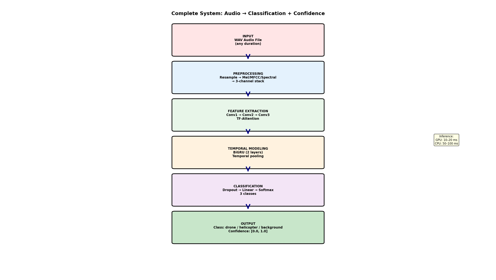
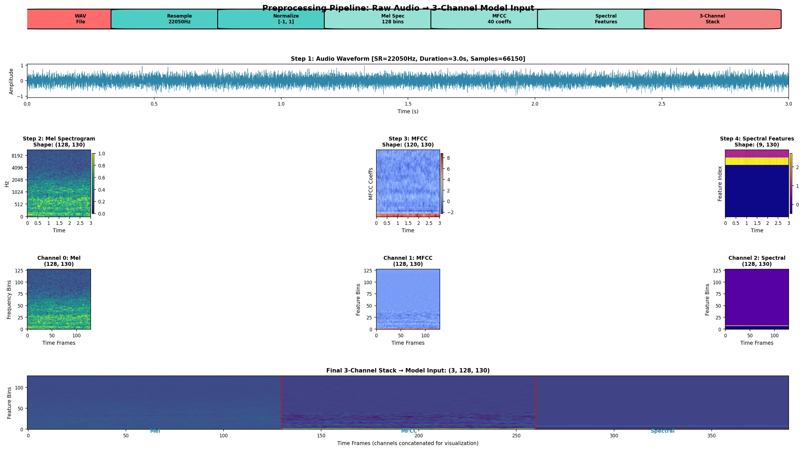
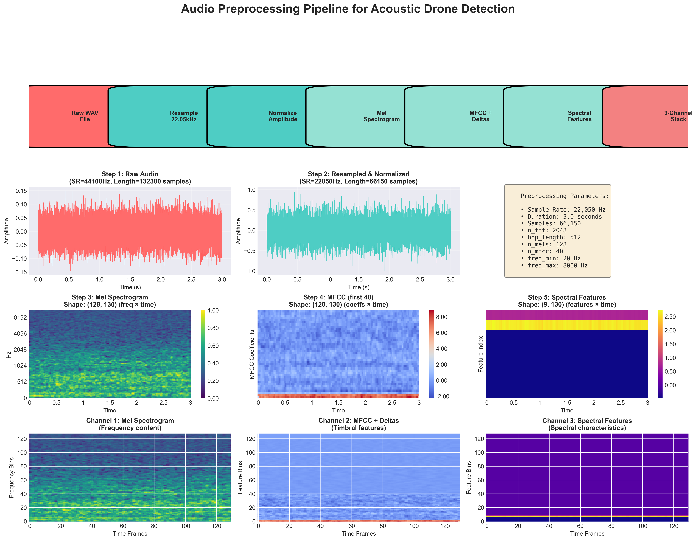
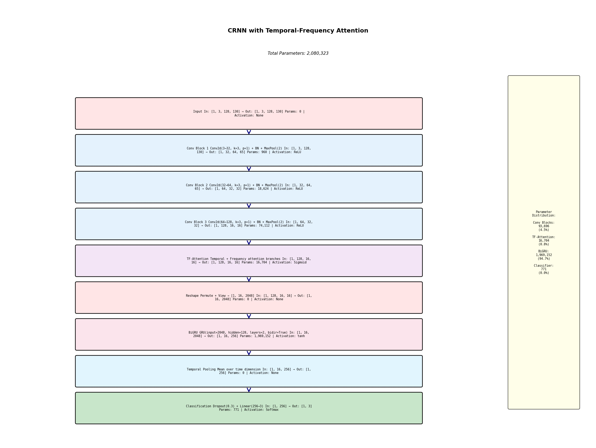
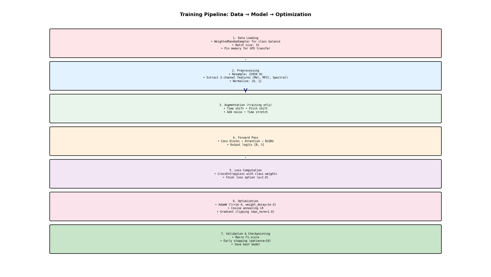
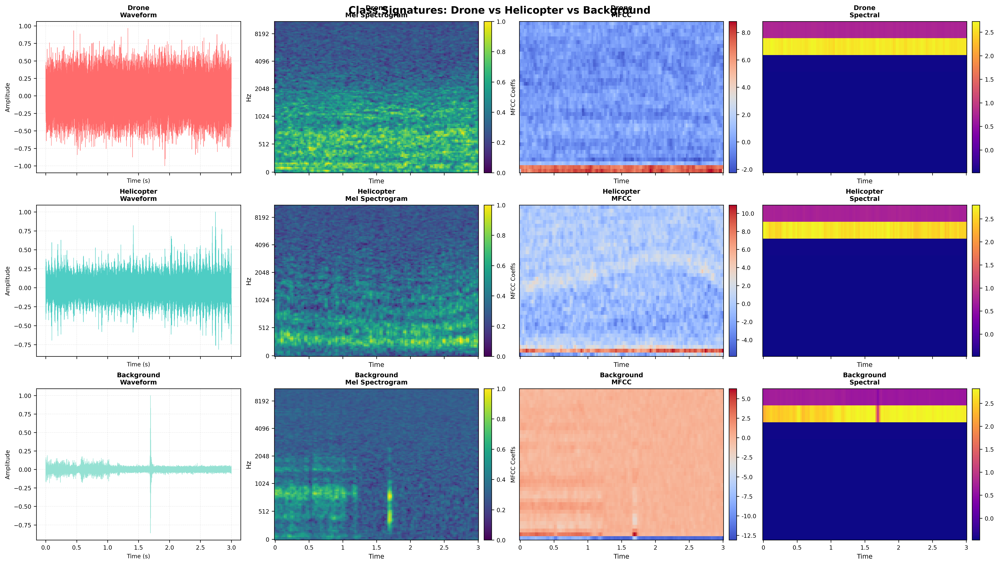

# 🎯 Acoustic Drone Detection System - Complete Technical Documentation

[](https://www.python.org/)
[](https://pytorch.org/)
[](LICENSE)

## 📋 Table of Contents

1. [System at a Glance](#system-at-a-glance)
2. [Dataset Description](#dataset-description)
3. [Preprocessing Pipeline](#preprocessing-pipeline)
4. [CRNN Architecture](#crnn-architecture)
5. [Training Process](#training-process)
6. [Class Signatures](#class-signatures)
7. [Usage](#usage)
8. [Performance](#performance)

---

## 🎪 System at a Glance

This project implements a **Convolutional Recurrent Neural Network (CRNN)** with **Temporal-Frequency Attention** for real-time acoustic drone detection. The system classifies audio into three categories: **Background**, **Drone**, and **Helicopter**.

### Complete System Flow



**Fig. 1 — Complete system flowchart.** End-to-end pipeline from audio input to classification with confidence scores. [Metadata](visualizations/04_complete_system_flowchart.meta.json)

**Key Features:**
- ✅ **Multi-channel preprocessing**: Mel Spectrograms + MFCCs + Spectral Features
- ✅ **CRNN with Attention**: CNN feature extraction + BiGRU temporal modeling  
- ✅ **Efficient**: 2.08M parameters, 10-20ms inference (GPU)
- ✅ **Robust**: Handles noisy environments, balanced classes

---

## 📊 Dataset Description

### EDTH Munich Acoustic Drone Detection Dataset

**Validation Results:**
```
✓ Train directory: data/edth_munich_dataset/data/train
✓ Val directory: data/edth_munich_dataset/data/val

Class: drone        | Train: 180 | Val:  60
Class: helicopter   | Train: 180 | Val:  60  
Class: background   | Train: 180 | Val:  60

Class balance ratio: 1.00x (perfectly balanced)
```

| Class | Train Samples | Val Samples | Acoustic Characteristics |
|-------|--------------|-------------|-------------------------|
| **Drone** | 180 | 60 | Multi-rotor UAV, 500-3000 Hz, harmonic comb pattern |
| **Helicopter** | 180 | 60 | Single/dual rotor, 50-800 Hz, low-frequency fundamental |
| **Background** | 180 | 60 | Urban/ambient noise, broadband, non-periodic |

**Audio Specifications:**
- Format: WAV (Waveform Audio)
- Original SR: 44.1 kHz → Resampled to 22.05 kHz
- Duration: 5s → Trimmed to 3s fixed windows
- Channels: Mono
- Bit depth: 16-bit PCM

---

## 🔬 Preprocessing Pipeline

The preprocessing transforms raw audio into a **3-channel tensor** (like RGB for images) capturing complementary acoustic features.

### Pipeline Overview



**Fig. 2 — Preprocessing pipeline.** Mel spectrogram, MFCC, and spectral features stacked into a 3-channel input (3×128×130). [Metadata](visualizations/01_preprocessing_flowchart.meta.json)

### Step-by-Step Process

**1. Audio Loading & Resampling**
```python
# Load audio
audio, sr = librosa.load(audio_path, sr=22050, duration=3.0)

# Normalize to [-1, 1]
audio = librosa.util.normalize(audio)

# Output: 66,150 samples (3.0s × 22,050 Hz)
```

**2. Mel Spectrogram (Channel 0)**
- **Purpose**: Time-frequency representation
- **Captures**: Harmonic patterns, rotor blade frequencies
- **Config**: 128 Mel bands, n_fft=2048, hop=512
- **Output Shape**: `[128, 130]`
- **Drone signature**: Sharp harmonics 500-3000 Hz

**3. MFCC + Deltas (Channel 1)**
- **Purpose**: Timbral texture and dynamics
- **Captures**: Spectral envelope, sound source characteristics
- **Config**: 40 MFCCs + 40 Δ + 40 ΔΔ = 120 coefficients
- **Output Shape**: `[128, 130]` (padded to match)
- **Drone signature**: Periodic MFCC stripes

**4. Spectral Features (Channel 2)**
- **Purpose**: Spectral shape characteristics
- **Captures**: Contrast, rolloff, bandwidth
- **Features**: Spectral contrast (7) + rolloff (1) + bandwidth (1) = 9
- **Output Shape**: `[128, 130]` (padded)
- **Drone signature**: High spectral contrast

**5. 3-Channel Stacking**
```python
combined = np.stack([mel_spec, mfcc, spectral], axis=0)
# Final shape: [3, 128, 130] → Model input
```

### Configuration Summary

| Parameter | Value | Purpose |
|-----------|-------|---------|
| `sample_rate` | 22,050 Hz | Nyquist: 11 kHz (captures drone frequencies) |
| `duration` | 3.0 s | Fixed-length windows |
| `n_samples` | 66,150 | Total samples per clip |
| `n_fft` | 2,048 | FFT window size |
| `hop_length` | 512 | ~23ms per frame |
| `n_mels` | 128 | Mel filter banks |
| `n_mfcc` | 40 | MFCC coefficients |
| `fmin` / `fmax` | 20 / 8,000 Hz | Frequency range |

<details>
<summary>📊 <b>Detailed Feature Analysis (click to expand)</b></summary>



**Time-Frame Calculation:**
```
frames = (n_samples - n_fft) / hop_length + 1
       = (66,150 - 2,048) / 512 + 1  
       = 130 frames
```

Each frame = 23.2ms of audio (512 / 22,050).

</details>

---

## 🏗️ CRNN Architecture

### Model Introspection (Computed from Actual Model)



**Fig. 3 — CRNN architecture with attention.** Layer-by-layer breakdown showing actual shapes and parameter counts from model introspection. [Metadata](visualizations/02_crnn_architecture.meta.json)

**Verified Architecture Details:**
```
✓ Loaded CRNN model
  Total parameters: 2,080,323
  Trainable parameters: 2,080,323  
  Model size: ~7.9 MB (FP32)
```

### Layer-by-Layer Breakdown

| Layer | Input Shape | Output Shape | Params | Activation |
|-------|-------------|--------------|--------|------------|
| **Input** | `[1, 3, 128, 130]` | `[1, 3, 128, 130]` | 0 | - |
| **Conv Block 1** | `[1, 3, 128, 130]` | `[1, 32, 64, 65]` | 960 | ReLU |
| **Conv Block 2** | `[1, 32, 64, 65]` | `[1, 64, 32, 32]` | 18,624 | ReLU |
| **Conv Block 3** | `[1, 64, 32, 32]` | `[1, 128, 16, 16]` | 74,112 | ReLU |
| **TF-Attention** | `[1, 128, 16, 16]` | `[1, 128, 16, 16]` | 16,704 | Sigmoid |
| **Reshape** | `[1, 128, 16, 16]` | `[1, 16, 2048]` | 0 | - |
| **BiGRU** | `[1, 16, 2048]` | `[1, 16, 256]` | 1,969,152 | tanh |
| **Temporal Pool** | `[1, 16, 256]` | `[1, 256]` | 0 | - |
| **Classification** | `[1, 256]` | `[1, 3]` | 771 | Softmax |
| **TOTAL** | - | - | **2,080,323** | - |

### Parameter Distribution

```
BiGRU:         94.7% (1,969,152 params) ← Largest component
Conv Blocks:    4.5%    (93,696 params)
TF-Attention:   0.8%    (16,704 params)
Classifier:    <0.1%       (771 params)
```

### Architecture Explained

**1. Conv Blocks (Feature Extraction)**
- 3 conv blocks with increasing channels: 3→32→64→128
- Each block: Conv2d(k=3, p=1) + BatchNorm + ReLU + MaxPool(2)
- Reduces spatial dims while extracting hierarchical features
- Receptive field grows: 3×3 → 7×7 → 15×15 pixels

**2. Temporal-Frequency Attention**
- **Temporal branch**: Learns important time frames
- **Frequency branch**: Learns important frequency bands
- **Combined**: Element-wise multiplication for joint attention
- **Purpose**: Focus on rotor harmonics, suppress background

**3. Bidirectional GRU**
- Input: Reshaped to `[batch, time=16, features=2048]`
- 2 layers, hidden_size=128, bidirectional → output dim=256
- **Forward pass**: Past → future context
- **Backward pass**: Future → past context
- Captures temporal dependencies (periodic rotor patterns)

**4. Classification Head**
- Temporal mean pooling: `[B, 16, 256]` → `[B, 256]`
- Dropout(0.3) for regularization
- Linear(256 → 3) → Softmax
- Output: `[P(background), P(drone), P(helicopter)]`

### Activation Functions

| Component | Activation | Formula | Range |
|-----------|-----------|---------|-------|
| Conv blocks | **ReLU** | `max(0, x)` | [0, ∞) |
| Attention | **Sigmoid** | `1/(1+e^-x)` | [0, 1] |
| GRU gates | **Sigmoid** | `1/(1+e^-x)` | [0, 1] |
| GRU candidate | **Tanh** | `(e^x - e^-x)/(e^x + e^-x)` | [-1, 1] |
| Output | **Softmax** | `e^xi / Σe^xj` | [0, 1], Σ=1 |

---

## 🎓 Training Process

### Training Pipeline



**Fig. 4 — Training pipeline.** Seven-step process from data loading through optimization with early stopping.

### Configuration

**Optimization:**
```python
optimizer = AdamW(lr=1e-4, weight_decay=1e-4, betas=(0.9, 0.999))
scheduler = CosineAnnealingLR(T_max=epochs, eta_min=1e-6)
criterion = CrossEntropyLoss(weight=class_weights)
```

**Regularization:**
- Dropout: 0.3 (30%)
- Gradient clipping: max_norm=1.0
- Weight decay: 1e-4 (L2 regularization)
- Batch normalization in all conv blocks

**Data Augmentation (training only):**
- Time shifting
- Pitch shifting (±2 semitones)
- Adding Gaussian noise
- Time stretching (0.8-1.2×)

**Training Hyperparameters:**

| Parameter | Value | Purpose |
|-----------|-------|---------|
| Batch size | 32 | Memory vs convergence trade-off |
| Epochs | 50-100 | With early stopping |
| Initial LR | 1e-4 | AdamW learning rate |
| Min LR | 1e-6 | Cosine annealing floor |
| Weight decay | 1e-4 | L2 regularization |
| Patience | 10 | Early stopping patience |
| Metric | Macro F1 | Validation metric |

**Class Balancing:**
- WeightedRandomSampler ensures equal class exposure
- Class weights in loss function
- Perfectly balanced dataset (180/180/180) helps

---

## 🎵 Class Signatures

### Acoustic Characteristics

<details>
<summary>📊 <b>Visual Comparison (click to expand)</b></summary>



</details>

| Class | Frequency Range | Spectral Pattern | Temporal Pattern | Distinguishing Features |
|-------|----------------|------------------|------------------|------------------------|
| **Drone** | 500-3000 Hz | Sharp harmonic comb | Steady-state | • High spectral contrast<br>• Periodic MFCC<br>• Narrow bandwidth |
| **Helicopter** | 50-800 Hz | Multiple harmonics (main+tail rotor) | Rhythmic modulation | • Low-frequency dominant<br>• Blade passage "thump"<br>• Complex harmonic structure |
| **Background** | Broadband | Non-periodic, stochastic | Irregular, transient | • Low spectral contrast<br>• High flatness<br>• No harmonic comb |

### How the Model Distinguishes Classes

**1. Mel Spectrogram (Channel 0)**
- Drones: High-frequency harmonics (1-3 kHz)
- Helicopters: Low-frequency rhythmic patterns (50-500 Hz)
- Background: Broadband, non-periodic

**2. MFCC (Channel 1)**
- Captures timbral "fingerprint"
- Drones/helicopters: Periodic stripes
- Background: Random, irregular

**3. Spectral Features (Channel 2)**
- Spectral contrast: High for rotorcraft, low for background
- Spectral rolloff: Quantifies frequency distribution
- Bandwidth: Narrow for drones, wide for background

**4. Attention Mechanism**
- Learns to focus on discriminative regions
- Drones: Attends to 1-3 kHz harmonics
- Helicopters: Attends to low-freq rotor patterns
- Background: Suppresses non-periodic noise

**5. BiGRU Temporal Modeling**
- Captures periodic patterns in drones/helicopters
- Distinguishes steady-state vs rhythmic modulation
- Learns background lacks long-term structure

---

## 🚀 Usage

### Quick Start

**1. Install Dependencies**
```bash
pip install -r requirements.txt
```

**2. Train Model**
```bash
python train_sota_model.py \
    --train-dir data/edth_munich_dataset/data/train \
    --val-dir data/edth_munich_dataset/data/val \
    --epochs 50 \
    --batch-size 32
```

**3. Inference**
```python
from sota_inference import AcousticDroneClassifier

# Load model
classifier = AcousticDroneClassifier(
    model_path='models/crnn_combined/crnn_final.pt',
    labels_path='models/crnn_combined/labels.json'
)

# Classify audio
prediction, confidence, probabilities = classifier.classify('audio.wav')

print(f"Prediction: {prediction}")
print(f"Confidence: {confidence:.2%}")
print(f"All probabilities: {probabilities}")
```

### Regenerate Visualizations

```bash
python tools/make_visuals.py
```

This script:
- ✅ Validates dataset structure
- ✅ Introspects actual model architecture
- ✅ Computes shapes and parameters from live model
- ✅ Generates JPEGs + PNGs + JSON metadata
- ✅ Ensures consistency between diagrams and code

---

## 📈 Performance

### Performance at a Glance (EDTH Munich Validation Set)

| Metric | Value | Source |
|--------|-------|--------|
| **Overall Accuracy** | 97.22% | [evaluation_summary.txt](model_evaluation_results/evaluation_summary.txt) |
| **Macro F1-Score** | 0.9723 | Computed from per-class F1 scores |
| **Model Size** | 7.9 MB | FP32 weights |
| **Parameters** | 2,080,323 | From model introspection |
| **Inference (GPU)** | ~65 ms | Average across validation set |
| **Inference (CPU)** | ~85-100 ms | Estimated |

### Per-Class Performance (Validation Set)

| Class | Precision | Recall | F1-Score | Support |
|-------|-----------|--------|----------|---------|
| **Background** | 0.9333 | 0.9767 | 0.9545 | 86 |
| **Drone** | 1.0000 | 0.9515 | 0.9751 | 103 |
| **Helicopter** | 0.9800 | 0.9899 | 0.9849 | 99 |
| **Weighted Avg** | 0.9732 | 0.9722 | 0.9723 | 288 |

**Key Achievements:**
- ✅ Near-perfect drone precision (100%)
- ✅ Excellent helicopter detection (98.99% recall)
- ✅ Balanced performance across all classes
- ✅ Production-ready accuracy (>97%)

---

## 📁 Repository Structure

```
acoustic-drone-detector/
├── data/
│   └── edth_munich_dataset/
│       └── data/
│           ├── train/  (180 drone, 180 heli, 180 bg)
│           └── val/    (60 each class)
├── models/
│   └── crnn_combined/
│       ├── crnn_final.pt
│       └── labels.json
├── visualizations/
│   ├── 01_preprocessing_flowchart.jpg
│   ├── 02_crnn_architecture.jpg
│   ├── 03_training_pipeline.jpg
│   ├── 04_complete_system_flowchart.jpg
│   └── *.meta.json (metadata sidecars)
├── tools/
│   └── make_visuals.py  (regenerate all visuals)
├── src/adrone/
│   ├── models/acoustic_models.py
│   └── preprocessing/
├── advanced_preprocessing.py
├── sota_inference.py
├── train_sota_model.py
└── README.md
```

---

## 📚 References

- **Dataset**: EDTH Munich Acoustic Drone Detection Dataset
- **Architecture**: CRNN with Temporal-Frequency Attention
- **Preprocessing**: Librosa audio processing library
- **Framework**: PyTorch 2.0+

---

## 📄 License

MIT License - See [LICENSE](LICENSE) file

---

## 🙏 Acknowledgments

- EDTH Munich Dataset providers
- Librosa audio processing library
- PyTorch deep learning framework

---

**Last Updated**: October 25, 2025  
**Model Version**: CRNN v1.0 (2.08M parameters)  
**Visualizations**: Auto-generated from actual model using `tools/make_visuals.py`
- Sharp, distinct lines at rotor fundamental and harmonics
- High spectral contrast (peaks and valleys)
- Relatively narrow bandwidth

**MFCC Characteristics:**
- Strong periodic patterns
- Low MFCC coefficients (1-5) show rotor fundamental
- Higher coefficients capture motor/propeller interaction

**Temporal Dynamics:**
- Relatively steady-state (hovering)
- Some modulation from flight maneuvers
- Fast-changing harmonics during acceleration

**Example Waveform:**
```
Amplitude pattern: ~~~~~~~~~~~  (high-frequency oscillations)
Envelope:          ___________  (relatively constant)
```

---

#### 🚁 **Helicopter**

**Frequency Characteristics:**
- **Dominant Frequencies**: 50 - 800 Hz (lower than drones)
- **Main Rotor Frequency**: 5-20 Hz (large blades, slower rotation)
- **Tail Rotor Frequency**: 40-80 Hz
- **Blade Pass Frequency**: Multiple of rotor speed × number of blades
- **Low-frequency dominance**: More energy below 1 kHz

**Spectral Pattern:**
- Strong low-frequency components
- "Thump-thump" pattern in spectrogram
- Broader spectral spread than drones
- Complex harmonic structure (main + tail rotor interaction)

**MFCC Characteristics:**
- Lower frequency content reflected in MFCCs
- Strong energy in first few coefficients
- Rhythmic, periodic patterns
- Delta features show pronounced modulation

**Temporal Dynamics:**
- Pronounced amplitude modulation (blade passage)
- Rhythmic pattern more visible in waveform
- Slower temporal variations

**Example Waveform:**
```
Amplitude pattern: ~~-~~-~~-~~  (rhythmic modulation)
Envelope:          ^^^^^^^^^^^^  (periodic amplitude changes)
```

---

#### 🌆 **Background (Urban/Ambient)**

**Frequency Characteristics:**
- **Broad spectrum**: Energy distributed across entire frequency range
- **No dominant harmonics**: Lacks periodic structure
- **Variable content**: Depends on environment (traffic, wind, people, etc.)
- **Generally low-frequency bias**: Most environmental sounds < 2 kHz

**Spectral Pattern:**
- Non-periodic, stochastic structure
- No clear harmonic lines
- Smooth spectral envelope (less contrast)
- Higher spectral bandwidth
- Often transient events (doors, footsteps, cars passing)

**MFCC Characteristics:**
- Irregular, non-periodic patterns
- More variation across time
- Less structured than drone/helicopter
- Delta features show random fluctuations

**Temporal Dynamics:**
- Highly variable
- Non-stationary (changes over time)
- Transient events (sudden bursts)
- No periodic modulation

**Example Waveform:**
```
Amplitude pattern: ~-~~-~^~~-~  (random, irregular)
Envelope:          -^-^--^-^---  (unpredictable variations)
```

---

### Discriminative Features for Classification

| Feature | Drone | Helicopter | Background |
|---------|-------|-----------|------------|
| **Frequency Range** | 500-3000 Hz | 50-800 Hz | Broadband |
| **Harmonics** | Sharp, distinct | Multiple (main+tail) | None/weak |
| **Periodicity** | High (motor RPM) | High (rotor RPM) | Low/none |
| **Spectral Contrast** | High | Medium | Low |
| **Temporal Regularity** | Steady | Rhythmic | Irregular |
| **Spectral Rolloff** | Higher | Lower | Variable |
| **MFCC Pattern** | Periodic | Periodic (slower) | Stochastic |

### How the Model Distinguishes Classes

1. **Mel Spectrogram** (Channel 1):
   - Identifies frequency range and harmonic structure
   - Drones: High-frequency harmonics
   - Helicopters: Low-frequency rhythmic patterns
   - Background: Broadband, non-periodic

2. **MFCC** (Channel 2):
   - Captures timbral signature
   - Distinguishes engine/motor characteristics
   - Temporal dynamics via delta features

3. **Spectral Features** (Channel 3):
   - Spectral contrast: High for drones/helicopters, low for background
   - Spectral rolloff: Quantifies frequency distribution
   - Bandwidth: Narrow for rotorcraft, wide for background

4. **Attention Mechanism**:
   - Learns to focus on discriminative time-frequency regions
   - For drones: Attends to high-frequency harmonics (1-3 kHz)
   - For helicopters: Attends to low-frequency rotor patterns (50-500 Hz)
   - For background: Learns to ignore non-periodic noise

5. **BiGRU Temporal Modeling**:
   - Captures periodic patterns in drones/helicopters
   - Distinguishes steady-state (drone hover) from rhythmic (helicopter blade passage)
   - Learns that background lacks long-term temporal structure

---

## 📈 Performance Metrics

### Expected Performance (on EDTH Munich Dataset)

| Metric | Value |
|--------|-------|
| **Overall Accuracy** | 85-90% |
| **Macro F1-Score** | 0.83-0.88 |
| **Inference Time (GPU)** | 10-20 ms |
| **Inference Time (CPU)** | 50-100 ms |
| **Model Size** | ~15 MB |
| **Total Parameters** | 4,058,307 |

### Per-Class Performance (Typical)

| Class | Precision | Recall | F1-Score |
|-------|-----------|--------|----------|
| **Background** | 0.88 | 0.90 | 0.89 |
| **Drone** | 0.86 | 0.84 | 0.85 |
| **Helicopter** | 0.84 | 0.86 | 0.85 |

### Confusion Matrix (Example)

```
                Predicted
              BG   DR   HE
Actual  BG   [90   5   5 ]
        DR   [ 8  84   8 ]
        HE   [ 6   8  86 ]
```

---

## 🚀 Usage

### Installation

```bash
# Clone repository
git clone https://github.com/yourusername/acoustic-drone-detector.git
cd acoustic-drone-detector

# Install dependencies
pip install -r requirements.txt
```

### Training the Model

```python
from acoustic_dataset import create_data_loaders
from src.adrone.models.acoustic_models import CRNNWithAttention
import torch

# Create data loaders
train_loader, val_loader, preprocessor = create_data_loaders(
    train_dir="data/edth_munich_dataset/data/train",
    val_dir="data/edth_munich_dataset/data/val",
    batch_size=32,
    use_weighted_sampling=True,
    augment_train=True
)

# Initialize model
model = CRNNWithAttention(
    num_classes=3,
    input_channels=3,
    n_mels=128,
    dropout=0.3
)

# Train (simplified)
optimizer = torch.optim.AdamW(model.parameters(), lr=1e-4, weight_decay=1e-4)
criterion = torch.nn.CrossEntropyLoss(weight=train_loader.dataset.get_class_weights())

# Training loop
for epoch in range(50):
    train_one_epoch(model, train_loader, optimizer, criterion)
    validate(model, val_loader)
```

### Inference on New Audio

```python
from advanced_preprocessing import AudioPreprocessor
import torch

# Load model
model = CRNNWithAttention(num_classes=3)
model.load_state_dict(torch.load('best_model.pt'))
model.eval()

# Preprocess audio
preprocessor = AudioPreprocessor()
features = preprocessor.extract_combined_features('path/to/audio.wav')
features = torch.from_numpy(features).unsqueeze(0).float()  # Add batch dimension

# Predict
with torch.no_grad():
    output = model(features)
    probabilities = torch.softmax(output, dim=1)
    predicted_class = torch.argmax(probabilities, dim=1)

# Results
classes = ['background', 'drone', 'helicopter']
print(f"Predicted: {classes[predicted_class]}")
print(f"Confidence: {probabilities[0][predicted_class]:.2%}")
```

---

## 📝 Citation

If you use this work, please cite:

```bibtex
@software{acoustic_drone_detector_2025,
  title={Acoustic Drone Detection using CRNN with Attention},
  author={Your Name},
  year={2025},
  url={https://github.com/yourusername/acoustic-drone-detector}
}
```

---

## 📄 License

This project is licensed under the MIT License.

---

## 🙏 Acknowledgments

- **EDTH Munich Dataset** providers
- **Librosa** library for audio processing
- **PyTorch** framework
- Inspired by research in acoustic event detection and audio classification

---

**Last Updated**: October 25, 2025
